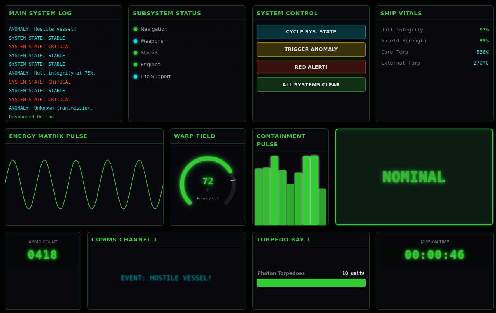

English | [Español](./README-ES.md)

---

# Dynamic-SciFi-Dashboard-Kit

[](https://opensource.org/licenses/MIT)
[](https://github.com/Soyunomas/Dynamic-SciFi-Dashboard-Kit/stargazers)
[](https://github.com/Soyunomas/Dynamic-SciFi-Dashboard-Kit/network/members)

**Dynamic-SciFi-Dashboard-Kit** is a lightweight and customizable JavaScript library for creating interactive user interfaces with a futuristic, sci-fi aesthetic. It offers a set of ready-to-use "panel" components designed for building dynamic and visually appealing dashboards.

## Features

*   **Modular Components:** A variety of panels for different purposes (logs, alerts, data, graphs, etc.).
*   **Sci-Fi Aesthetics:** Predefined styles with a futuristic touch, including effects like "scanlines" and "sparks".
*   **Customizable:** Appearance can be easily modified using CSS variables.
*   **Modern JavaScript:** Written in ES6+ with no heavy external dependencies (only uses Bootstrap for example layouts).
*   **Easy to Use:** Simple API to integrate and control the panels.
*   **Responsive (with Bootstrap):** Examples and panel structure are designed to adapt to different screen sizes with the help of a framework like Bootstrap.

## Demo

Here you can see a demo with all the panels (click the buttons to change states).

<p align="center">
  <a href="https://soyunomas.github.io/Dynamic-SciFi-Dashboard-Kit/demo.html" target="_blank" rel="noopener noreferrer">
    
  </a>
</p>

[**Link**](https://soyunomas.github.io/Dynamic-SciFi-Dashboard-Kit/demo.html)

## (English)

## Available Panels

Here's a quick look at the panels offered by the library. Click on an image to see a live example.

| Panel                         | Screenshot                                                                                         | Live Example (GitHub Pages)                                                   |
| :---------------------------- | :-------------------------------------------------------------------------------------------------: | :----------------------------------------------------------------------------: |
| **LogDisplayPanel**           | [![LogDisplayPanel Screenshot][log-screenshot]](https://soyunomas.github.io/Dynamic-SciFi-Dashboard-Kit/examples/LogDisplayPanel.html) | [View Example](https://soyunomas.github.io/Dynamic-SciFi-Dashboard-Kit/examples/LogDisplayPanel.html) |
| **CriticalWarningTextPanel**  | [![CriticalWarningTextPanel Screenshot][critwarn-screenshot]](https://soyunomas.github.io/Dynamic-SciFi-Dashboard-Kit/examples/CriticalWarningTextPanel.html) | [View Example](https://soyunomas.github.io/Dynamic-SciFi-Dashboard-Kit/examples/CriticalWarningTextPanel.html) |
| **KeyValueListPanel**       | [![KeyValueListPanel Screenshot][kv-screenshot]](https://soyunomas.github.io/Dynamic-SciFi-Dashboard-Kit/examples/KeyValueListPanel.html) | [View Example](https://soyunomas.github.io/Dynamic-SciFi-Dashboard-Kit/examples/KeyValueListPanel.html) |
| **LedDisplayPanel**           | [![LedDisplayPanel Screenshot][led-screenshot]](https://soyunomas.github.io/Dynamic-SciFi-Dashboard-Kit/examples/LedDisplayPanel.html) | [View Example](https://soyunomas.github.io/Dynamic-SciFi-Dashboard-Kit/examples/LedDisplayPanel.html) |
| **DynamicTextPanel**        | [![DynamicTextPanel Screenshot][dyntext-screenshot]](https://soyunomas.github.io/Dynamic-SciFi-Dashboard-Kit/examples/DynamicTextPanel.html) | [View Example](https://soyunomas.github.io/Dynamic-SciFi-Dashboard-Kit/examples/DynamicTextPanel.html) |
| **ActionButtonsPanel**      | [![ActionButtonsPanel Screenshot][action-screenshot]](https://soyunomas.github.io/Dynamic-SciFi-Dashboard-Kit/examples/ActionButtonsPanel.html) | [View Example](https://soyunomas.github.io/Dynamic-SciFi-Dashboard-Kit/examples/ActionButtonsPanel.html) |
| **CanvasGraphPanel**        | [![CanvasGraphPanel Screenshot][canvas-screenshot]](https://soyunomas.github.io/Dynamic-SciFi-Dashboard-Kit/examples/CanvasGraphPanel.html) | [View Example](https://soyunomas.github.io/Dynamic-SciFi-Dashboard-Kit/examples/CanvasGraphPanel.html) |
| **IntegrityPulsePanel**     | [![IntegrityPulsePanel Screenshot][pulse-screenshot]](https://soyunomas.github.io/Dynamic-SciFi-Dashboard-Kit/examples/IntegrityPulsePanel.html) | [View Example](https://soyunomas.github.io/Dynamic-SciFi-Dashboard-Kit/examples/IntegrityPulsePanel.html) |
| **CircularGaugePanel**      | [![CircularGaugePanel Screenshot][circgauge-screenshot]](https://soyunomas.github.io/Dynamic-SciFi-Dashboard-Kit/examples/CircularGaugePanel.html) | [View Example](https://soyunomas.github.io/Dynamic-SciFi-Dashboard-Kit/examples/CircularGaugePanel.html) |
| **StatusIndicatorLedPanel** | [![StatusIndicatorLedPanel Screenshot][statusled-screenshot]](https://soyunomas.github.io/Dynamic-SciFi-Dashboard-Kit/examples/StatusIndicatorLedPanel.html) | [View Example](https://soyunomas.github.io/Dynamic-SciFi-Dashboard-Kit/examples/StatusIndicatorLedPanel.html) |
| **HorizontalBarGaugePanel** | [![HorizontalBarGaugePanel Screenshot][hgauge-screenshot]](https://soyunomas.github.io/Dynamic-SciFi-Dashboard-Kit/examples/HorizontalBarGaugePanel.html) | [View Example](https://soyunomas.github.io/Dynamic-SciFi-Dashboard-Kit/examples/HorizontalBarGaugePanel.html) |
| **ImageDisplayPanel**       | [![ImageDisplayPanel Screenshot][image-screenshot]](https://soyunomas.github.io/Dynamic-SciFi-Dashboard-Kit/examples/ImageDisplayPanel.html) | [View Example](https://soyunomas.github.io/Dynamic-SciFi-Dashboard-Kit/examples/ImageDisplayPanel.html) |
| **TrueCanvasGraphPanel**    | [![TrueCanvasGraphPanel Screenshot][truecanvas-screenshot]](https://soyunomas.github.io/Dynamic-SciFi-Dashboard-Kit/examples/TrueCanvasGraphPanel.html) | [View Example](https://soyunomas.github.io/Dynamic-SciFi-Dashboard-Kit/examples/TrueCanvasGraphPanel.html) |
| **TrueIntegrityPulsePanel** | [![TrueIntegrityPulsePanel Screenshot][truepulse-screenshot]](https://soyunomas.github.io/Dynamic-SciFi-Dashboard-Kit/examples/TrueIntegrityPulsePanel.html) | [View Example](https://soyunomas.github.io/Dynamic-SciFi-Dashboard-Kit/examples/TrueIntegrityPulsePanel.html) |
| **RadarDisplayPanel**       | [![RadarDisplayPanel Screenshot][radar-screenshot]](https://soyunomas.github.io/Dynamic-SciFi-Dashboard-Kit/examples/RadarDisplayPanel.html) | [View Example](https://soyunomas.github.io/Dynamic-SciFi-Dashboard-Kit/examples/RadarDisplayPanel.html) |
| **HeatmapPanel**            | [![HeatmapPanel Screenshot][heatmap-screenshot]](https://soyunomas.github.io/Dynamic-SciFi-Dashboard-Kit/examples/HeatmapPanel.html) | [View Example](https://soyunomas.github.io/Dynamic-SciFi-Dashboard-Kit/examples/HeatmapPanel.html) |


<!-- Link definitions for images (place them at the end of the file) -->
[log-screenshot]: ./screenshots/LogDisplayPanel.png
[critwarn-screenshot]: ./screenshots/CriticalWarningTextPanel.png
[kv-screenshot]: ./screenshots/KeyValueListPanel.png
[led-screenshot]: ./screenshots/LedDisplayPanel.png
[dyntext-screenshot]: ./screenshots/DynamicTextPanel.png
[action-screenshot]: ./screenshots/ActionButtonsPanel.png
[canvas-screenshot]: ./screenshots/CanvasGraphPanel.png
[pulse-screenshot]: ./screenshots/IntegrityPulsePanel.png
[circgauge-screenshot]: ./screenshots/CircularGaugePanel.png
[statusled-screenshot]: ./screenshots/StatusIndicatorLedPanel.png
[hgauge-screenshot]: ./screenshots/HorizontalBarGaugePanel.png
[image-screenshot]: ./screenshots/ImageDisplayPanel.png
[truecanvas-screenshot]: ./screenshots/TrueCanvasGraphPanel.png
[truepulse-screenshot]: ./screenshots/TrueIntegrityPulsePanel.png
[radar-screenshot]: ./screenshots/RadarDisplayPanel.png
[heatmap-screenshot]: ./screenshots/HeatmapPanel.png


## Installation

1.  Download (or clone) this repository.
2.  Include the `DynamicSciFiDashboardKit.css` and `DynamicSciFiDashboardKit.js` files in your HTML project:

```html
<head>
    <!-- ... your other head tags ... -->
    <link rel="stylesheet" href="path/to/DynamicSciFiDashboardKit.css">
</head>
<body>
    <!-- ... your HTML content ... -->
    <script src="path/to/DynamicSciFiDashboardKit.js"></script>
    <script>
        // Your code to initialize the panels
    </script>
</body>
```

## Usage Guide

For a detailed guide on how to use each panel, its options, and methods, please refer to the [**Complete Usage Guide (`docs/USAGE_GUIDE.md`)**](./docs/USAGE_GUIDE.md).

## Customization

The appearance of the panels can be extensively customized by overriding the CSS variables defined in `DynamicSciFiDashboardKit.css`. Review the CSS file to see the list of available variables.

Example:
```css
/* In your own CSS file, after importing DynamicSciFiDashboardKit.css */
:root {
    --dsdk-accent-color-main: #FF6347; /* Tomato as main accent color */
    --dsdk-panel-bg: rgba(20, 20, 30, 0.9);
    --dsdk-font-mono: 'Share Tech Mono', monospace;
}
```

## License

This project is licensed under the MIT License. See the [LICENSE](./LICENSE) file for more details.

---

Created by [Soyunomas](https://github.com/Soyunomas)
